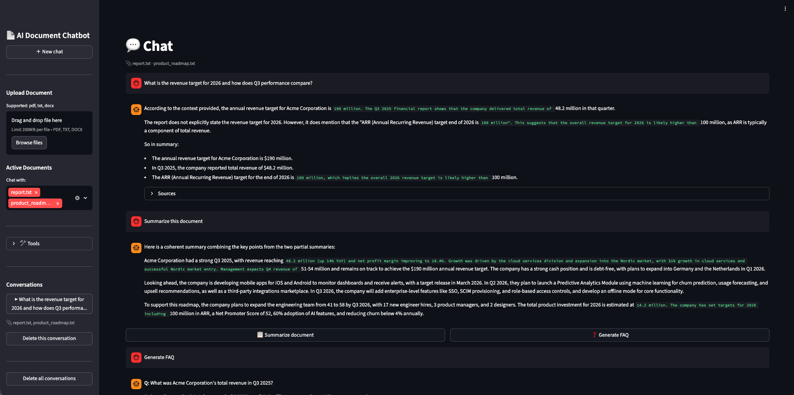
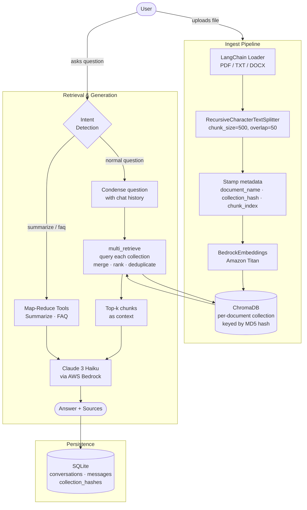

# AI Document Chatbot

A RAG-based chatbot that lets you upload documents and ask questions across all of them simultaneously. Built with Python, LangChain, AWS Bedrock, and ChromaDB. Live at [simonfallman.xyz](https://simonfallman.xyz).



## Architecture



## Stack

- **Streamlit** — web UI
- **LangChain** — RAG orchestration
- **AWS Bedrock** — embeddings (Amazon Titan `titan-embed-text-v2`) + LLM (Claude 3 Haiku)
- **ChromaDB** — vector store, persisted to disk with per-document isolation
- **SQLite** — persistent chat history and conversation management
- **Docker** — containerization
- **GitHub Actions** — CI/CD pipeline (test + auto-deploy)

## Features

- Upload PDF, TXT, or DOCX files (max 5MB)
- **Multi-source retrieval** — select multiple documents and ask questions across all of them simultaneously
- Semantic search using vector embeddings — retrieves by meaning, not keywords
- Results merged and ranked by relevance score across all active documents
- Chunk metadata stamped at index time (`document_name`, `collection_hash`, `chunk_index`) for guaranteed provenance
- Conversational memory — follow-up questions work correctly
- Persistent chat history with conversation sidebar
- Per-document vector isolation via MD5-keyed ChromaDB collections
- Streaming responses
- Password protection (optional)
- **Tools:** multi-source document summarization (map-reduce) and FAQ generation

## Local Setup

**1. Install dependencies**
```bash
pip install -r requirements.txt
```

**2. Configure environment**
```bash
cp .env.example .env
```
Edit `.env` and set your AWS credentials. Optionally set `APP_PASSWORD` to enable password protection.

**3. Run**
```bash
streamlit run app.py
```

Open [http://localhost:8501](http://localhost:8501) in your browser.

## Docker

```bash
docker build -t ai-document-chatbot .
docker run -d -p 8501:8501 -v $(pwd)/chroma_db:/app/chroma_db --env-file .env --restart unless-stopped ai-document-chatbot
```

The `-v` flag mounts `chroma_db` from the host so indexed documents and chat history survive container restarts.

**Access the app** at `http://<your-server-ip>:8501`

## CI/CD

Every push to `main` triggers a GitHub Actions pipeline that:
1. Runs the test suite (17 tests)
2. SSHs into the server and redeploys if tests pass
3. Health checks `https://simonfallman.xyz` to confirm the app is live

## Configuration

| Setting | Default | Notes |
|---|---|---|
| LLM | `anthropic.claude-3-haiku-20240307-v1:0` | Change in `build_chain()` in `app.py` |
| Embedding model | `amazon.titan-embed-text-v2:0` | Change in `get_embeddings()` |
| Chunk size | 500 | Change in `build_vectorstore()` |
| Chunk overlap | 50 | Change in `build_vectorstore()` |
| Max file size | 5MB | Change `MAX_FILE_SIZE` in `app.py` |

## Running Tests

```bash
python3 -m pytest test_pipeline.py -v
```
